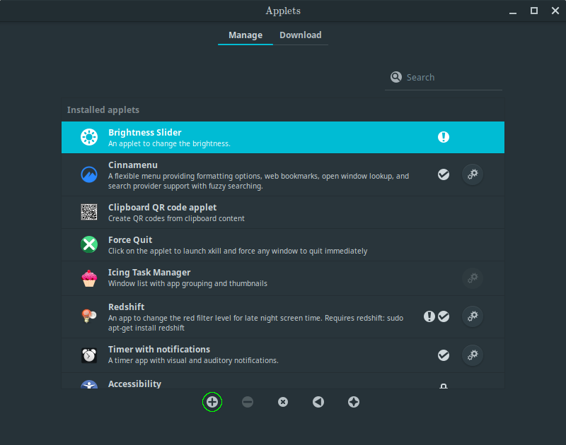
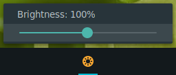
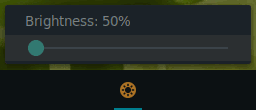

# Brightness-Applet
 An applet to change the brightness.
# Install
 Open a terminal in the root folder, then run `bash INSTALL.bash`.
 Then, open System Settings, select Applets, and add "Brightness Slider":
 
 
# Usage
 Once installed, click it to reveal the slider:
 
 
 
 Now, move the slider to change the brightness!
 
 
 
 _Note: Last image was simulated using GIMP._
